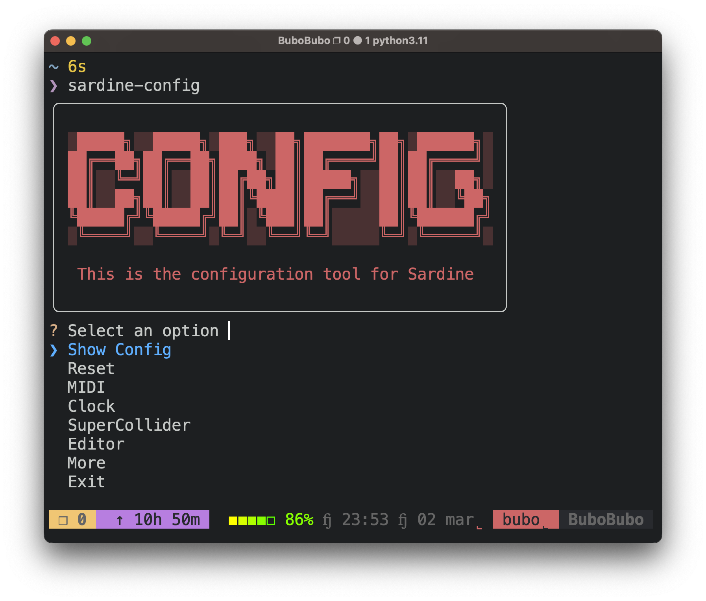

# Configuration tool

**Sardine** is shipping its own configuration tool, named **sardine-config**. 
Typing **sardine-config** in your terminal will open a configuration helper tool :) 
Using it, you can finetune your **Sardine** experience. 
Please note that **Sardine** is writing configuration files to a specific location depending 
on the OS you are using:

-   **Windows:** in the `%APPDATA%` folder.
-   **MacOS:** `~/Library/Application Support/Sardine`
-   **Linux:** `~/.local/share/Sardine/`

The path leading to the configuration folder can be printed out by typing 
`print_config()` from inside your typical **Sardine** session. 
How convenient :) You can also manage to print the `PATH` to your configuration
folder directly from the configuration tool.

There are three main files you can tweak to configure **Sardine**:

-   `config.json`: the main configuration file.
-   `default_superdirt.scd`: the default configuration for the audio engine.
-   `user_configuration.py`: a file that will be runned automatically everytime you start **Sardine**.

You may (or may not) also see a couple of other folders:
- `synths/` folder (to store SuperCollider synthesizers as `.scd` files)
- `buffers/` folder (used by the web editor, storing `.py` files).
